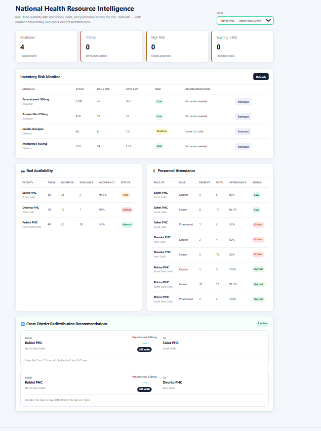

# 🏥 MedGuard AI

### National Health Resource & Supply Chain Intelligence

> **Predict. Prevent. Protect.**

MedGuard AI is a national-scale health resource management platform for Primary Health Centre (PHC) networks. It provides real-time visibility into medicine stocks, bed availability, and medical personnel attendance — with ML-based demand forecasting, early stock-out warnings, and automated cross-district redistribution recommendations.

Built for **Track 3 — Smart Health & Supply Chain Resilience** at **Hack Devengers 2.0** (BRICS Theme: Resilience).

---

## 🚀 Problem Statement

Public healthcare systems across developing nations face persistent supply chain vulnerabilities:

- ❌ No real-time visibility into medicine stocks across a distributed PHC network
- ❌ Unexplained stock-outs during demand spikes or health emergencies
- ❌ Overstocking and expiry wastage in facilities with surplus
- ❌ No coordination between districts to redistribute surplus to deficit areas
- ❌ Bed capacity and personnel attendance tracked separately, if at all

MedGuard AI addresses these challenges with a unified, federated-ready platform that any PHC network can deploy.

---

## 💡 Our Solution

A centralized dashboard + API that converts inventory, capacity, and staffing data into actionable national-scale recommendations.

### Core workflow

```text
Facility Data (Medicines, Beds, Staff)
              ↓
      Real-Time Aggregation
              ↓
   Risk Detection (per facility)
              ↓
      Demand Forecasting
              ↓
  Early Stock-Out Warnings
              ↓
Cross-District Redistribution
              ↓
    Better Health Outcomes
🎯 Alignment with Track 3 — Smart Health & Supply Chain Resilience
The track calls for a federated platform providing real-time visibility into medicine stocks, bed availability, and medical personnel attendance across a national PHC network, with demand forecasting, early stock-out warnings, and automated cross-district redistribution.

Requirement	Status	Where
Real-time medicine stock visibility 	✅ Implemented	GET /api/inventory
Real-time bed availability	          ✅ Implemented	GET /api/beds
Personnel attendance tracking	        ✅ Implemented	GET /api/staff
Multi-facility network view	          ✅ Implemented	GET /api/facilities
Demand forecasting	                  ✅ Implemented	GET /api/forecast/{medicine}
Early stock-out warnings	            ✅ Implemented	Risk levels (Critical/High/Medium/Low)
Cross-district redistribution	        ✅ Implemented	GET /api/redistribution
Federated learning across BRICS	      🚧 Future scope Model designed to train locally per facility
Patient footfall tracking	            🚧 Future scope Not in MVP
✨ Key Features
🏥 Multi-Facility Network
Supports multiple PHCs with independent stock, capacity, and staffing

Filter the entire dashboard by facility or view the national aggregate

Each facility has a facility_id, facility_name, and district

📦 Medicine Inventory Management
Track per medicine, per facility:

Name, category, current quantity, daily usage, reorder level, expiry date

Computed: days of stock remaining, recommended reorder quantity

⚠️ Risk Detection
Every medicine is classified automatically:

🔴 Critical — under 3 days of stock, or below reorder level

🟠 High — under 7 days, or below 1.5× reorder level

🟡 Medium — under 14 days

🟢 Low — healthy stock

🛏️ Bed Availability
Per-facility total, occupied, and available beds

Occupancy percentage with automatic status:

🔴 Critical at ≥95% occupancy

🟠 High at ≥80%

🟢 Normal below 80%

👩‍⚕️ Personnel Attendance
Staff tracked by facility and role (Doctor, Nurse, Pharmacist)

Attendance percentage with automatic status:

🔴 Critical below 60%

🟠 Low below 80%

🟢 Normal at 80%+

🤖 AI Demand Forecasting
7-day rolling forecast per medicine per facility

Uses Random Forest Regression on synthetic historical demand for the MVP

Returns predicted daily demand, total demand, and recommended order quantity

🔁 Cross-District Redistribution
The platform's most distinctive feature — automatic recommendations to move stock between facilities:

Deficit = a facility with fewer than 7 days of stock of a medicine

Surplus = a facility with more than 21 days of stock of the same medicine

Transfer = enough units to bring the deficit facility to a 14-day buffer, capped at the surplus facility's spare capacity above its own 21-day buffer

Each recommendation includes the source facility, destination facility, medicine, transfer units, and a human-readable justification.

📊 Interactive Dashboard
National summary cards (medicines, critical count, high-risk count, expiring)

Facility filter (dropdown) that re-scopes inventory + cards

Sortable inventory table with risk badges and recommendations

Side-by-side bed and staff tables

Redistribution panel that highlights transfers targeting the selected facility

Graceful error handling: backend down → visible error banner → Retry button

🧠 AI / ML Approach
The forecasting layer uses Python-based data processing and Random Forest Regression (scikit-learn).

Current MVP: Synthetic historical demand is generated per medicine based on its daily_usage, then the model predicts the next 7 days. Since the demo baseline has no real signal (only a time index against i.i.d. noise), predictions are near-constant — this is intentional and honest, not a bug.

Future improvement: Feeding real historical sales data with lag features, rolling averages, seasonal patterns, and supplier lead times would produce meaningful forecasts. Model evaluation with MAE/RMSE/MAPE is planned.

🏗️ System Architecture
text
                 ┌──────────────────────┐
                 │   React Dashboard    │
                 │      Frontend        │
                 └──────────┬───────────┘
                            │
                            ▼
                 ┌──────────────────────┐
                 │    FastAPI Backend   │
                 │        REST API      │
                 └──────────┬───────────┘
                            │
         ┌──────────────────┼──────────────────┐
         ▼                  ▼                  ▼
  ┌─────────────┐   ┌─────────────┐   ┌─────────────┐
  │  Inventory  │   │  Beds &     │   │  Forecast   │
  │    Data     │   │  Staff Data │   │   Engine    │
  └─────────────┘   └─────────────┘   └─────────────┘
         │                  │                  │
         └──────────────────┼──────────────────┘
                            ▼
                 ┌──────────────────────┐
                 │ Risk Detection &     │
                 │ Smart Redistribution │
                 └──────────────────────┘
🛠️ Technology Stack
Frontend: React · Vite · CSS
Backend: Python · FastAPI · Uvicorn
AI / ML: Pandas · NumPy · Scikit-learn · Random Forest Regression
Data: CSV-based datasets for the MVP (inventory.csv, beds.csv, staff.csv)

📁 Project Structure
text
MedGuard_AI_HackDevengers_MVP/
│
├── backend/
│   ├── app/
│   │   ├── __init__.py
│   │   └── main.py
│   │
│   ├── data/
│   │   ├── inventory.csv
│   │   ├── beds.csv
│   │   └── staff.csv
│   │
│   └── requirements.txt
│
├── frontend/
│   ├── src/
│   │   ├── main.jsx
│   │   └── styles.css
│   │
│   ├── index.html
│   ├── vite.config.js
│   ├── package.json
│   └── package-lock.json
│
├── README.md
└── .gitignore
⚙️ Installation & Setup
1. Clone the repository
bash
git clone https://github.com/ankitjaiswal13-blip/MedGuard_AI_HackDevengers_MVP.git
cd MedGuard_AI_HackDevengers_MVP
🔧 Backend Setup
bash
cd backend
python -m venv .venv
Activate the virtual environment:

Windows PowerShell:

powershell
.venv\Scripts\Activate.ps1
macOS / Linux:

bash
source .venv/bin/activate
Install dependencies:

bash
python -m pip install -r requirements.txt
Start the FastAPI server:

bash
python -m uvicorn app.main:app --reload --port 8000
Backend: http://127.0.0.1:8000

API docs: http://127.0.0.1:8000/docs

🎨 Frontend Setup
Open a second terminal:

bash
cd frontend
npm install
npm run dev
Frontend: http://localhost:5173/

The Vite dev server proxies /api/* requests to the backend on port 8000, so no CORS configuration is needed during development.

🔌 API Endpoints
Endpoint	Method	Purpose
/	GET	Health check
/api/inventory	GET	Medicine inventory with risk + reorder (accepts ?facility_id=)
/api/summary	GET	Dashboard summary counts (accepts ?facility_id=)
/api/facilities	GET	List of facilities with aggregate counts
/api/beds	GET	Bed occupancy per facility with status
/api/staff	GET	Personnel attendance by facility and role
/api/redistribution	GET	Cross-district transfer recommendations
/api/forecast/{medicine}	GET	7-day demand forecast (accepts ?days= and ?facility_id=)
/api/inventory	POST	Add a new medicine to the inventory
Example — Add a medicine
json
{
  "facility_id": "PHC-001",
  "facility_name": "Saket PHC",
  "district": "South Delhi",
  "name": "Paracetamol 500mg",
  "category": "Analgesic",
  "quantity": 120,
  "daily_usage": 45,
  "reorder_level": 100,
  "expiry_date": "2027-02-15"
}
Example — Redistribution recommendation
json
{
  "medicine": "Paracetamol 500mg",
  "from_facility": "Rohini PHC",
  "from_district": "North West Delhi",
  "to_facility": "Dwarka PHC",
  "to_district": "West Delhi",
  "transfer_units": 255,
  "reason": "Dwarka PHC has 0.9 days left; Rohini PHC has 26.7 days"
}
📊 Demo Scenario
The sample data ships with three Delhi PHCs:

Facility	District	Notable Status
Saket PHC	South Delhi	Baseline stock, 93% bed occupancy
Dwarka PHC	West Delhi	Critical Paracetamol (0.9 days), 50% doctor attendance
Rohini PHC	North West Delhi	Surplus Paracetamol (26.7 days), full staffing
The platform recommends transferring 255 units of Paracetamol from Rohini to Dwarka — a cross-district redistribution that no human would detect in real time.

🎯 Target Users
🏥 Government health departments managing PHC networks

💊 District health officers and supply chain coordinators

🏬 State-level health mission administrators (NHM equivalents)

📦 Medical inventory managers at facility level

🌍 Potential Impact
Reduce stock-outs of essential medicines by forecasting demand ahead of time

Reduce wastage from expiry by identifying surplus before it goes bad

Improve coordination across districts through automated redistribution

Give health administrators a single real-time view of medicines, beds, and staff

Support emergency response with early warnings during outbreaks or disasters

Enable federated learning across BRICS nations without sharing raw patient data

🔮 Future Scope
Federated learning across BRICS — the forecasting model is designed to train locally per facility and share only gradients

Real-time streaming — replace CSV batch loads with Kafka/MQTT edge nodes per facility

Patient footfall tracking — the remaining resource dimension named in the track brief

Real database — move from CSV to PostgreSQL / Supabase / Firebase

Supplier intelligence — lead time, reliability, purchase price, minimum order quantity

Advanced forecasting — lag features, seasonal patterns, MAE/RMSE/MAPE evaluation

Optimization-based redistribution — allocate a limited surplus pool across multiple competing deficits instead of independent per-deficit recommendations

Map-based visualization — geographic view of the PHC network with live status overlay

⚠️ Disclaimer
MedGuard AI is a hackathon prototype and inventory decision-support system. Its predictions should be validated against real operational inventory and demand data before being used in real healthcare operations. It is not intended to replace clinical judgment or professional healthcare decision-making.

👥 Team
Nexovate

Ankit Jaiswal

Protistha Chowdhury

Anurag Sanjay Mishra

Repository: https://github.com/ankitjaiswal13-blip/MedGuard_AI_HackDevengers_MVP

⭐ Project Vision
Don't wait for medicines to run out. Predict what healthcare needs next.

MedGuard AI — Predict. Prevent. Protect.
